# LawNidhi GraphRAG & GraphDB Architecture

This document outlines the architecture and execution flow of the LawNidhi Hybrid GraphRAG system. It combines local dense/sparse text retrieval with a Kùzu-backed Knowledge Graph to achieve highly accurate, deterministic, and citation-grounded legal intelligence.

## System Components

- **FastAPI REST Bridge:** The HTTP interface exposing the Knowledge Graph and RAG endpoints.
- **HybridGraphRAGRetriever:** The core engine that orchestrates parallel searches across both vector text and graph domains.
- **LegalDocumentStore (TF-IDF):** An in-memory vector index that handles semantic/keyword retrieval over chunked judicial order texts.
- **GraphContextExpander:** Translates text matches and keyword mentions into multi-hop subgraph traversals.
- **LegalGraphStore (Kùzu GraphDB):** The embedded property graph containing interconnected Cases, Judges, Counsels, Statutes, and Precedents.
- **LegalSynthesizer:** A supervisory wrapper that processes the unified graph/text context. It either generates a deterministic summary (zero token tax) or uses an LLM for natural language synthesis.

---

## 🌊 Execution Flow (Sequence Diagram)

The following sequence diagram illustrates the step-by-step execution path when a user submits a natural language legal query.

```mermaid
sequenceDiagram
    autonumber
    actor Client
    participant API as FastAPI Router
    participant Retriever as HybridGraphRAGRetriever
    participant VectorStore as LegalDocumentStore
    participant Expander as GraphContextExpander
    participant GraphDB as LegalGraphStore (Kùzu)
    participant Synthesizer as LegalSynthesizer
    participant LLM as External LLM (Optional)

    Client->>API: POST /api/rag/query (query text)
    API->>Retriever: retrieve(query, top_k)
    
    %% Phase 1: Semantic Text Retrieval
    rect rgb(30, 30, 30)
        Note over Retriever, VectorStore: Phase 1: Semantic Text Search
        Retriever->>VectorStore: search(query, top_k)
        VectorStore-->>Retriever: List[TextChunk] (with scores)
    end

    %% Extract candidate entities from text chunks and regex
    Retriever->>Retriever: Extract candidate_cases (doc_ids, case_names)

    %% Phase 2: Knowledge Graph Expansion
    rect rgb(30, 30, 30)
        Note over Retriever, GraphDB: Phase 2: Multi-Hop Subgraph Expansion
        Retriever->>Expander: expand_cases(candidate_cases)
        Expander->>GraphDB: MATCH (c:CASE)-[r]->(target)
        GraphDB-->>Expander: Statutory Provisions, Precedents, Judges
        Expander-->>Retriever: GraphContextNodes

        Retriever->>Expander: expand_by_keywords(query)
        Expander->>GraphDB: MATCH (s:SECTION)<-[r]-(c:CASE)
        GraphDB-->>Expander: Additional GraphContextNodes
        Expander-->>Retriever: Keyword-matched Nodes
    end

    %% Phase 3: Context Assembly & Synthesis
    Retriever->>Retriever: Assemble & deduplicate markdown-grounded context
    Retriever-->>API: HybridRetrievalResult
    
    API->>Synthesizer: synthesize(HybridRetrievalResult)
    
    alt External LLM Client Provided
        Synthesizer->>LLM: complete(system_prompt, formatted_context)
        LLM-->>Synthesizer: LLM Generated Legal Response
    else Deterministic Mode (Rule 11)
        Synthesizer->>Synthesizer: Generate deterministic markdown summary ($0 token tax)
    end
    
    Synthesizer-->>API: RAGAnswer (with citations & metadata)
    API-->>Client: 200 OK (JSON Response)
```

## Architectural Guidelines (Rule 11 Compliance)
Following our Agentic Architecture rules, the entire retrieval and context assembly process (Steps 1 through 7) is **100% deterministic and standalone**. The LLM (Step 9) is strictly treated as an optional supervisory layer that takes the highly structured, grounded markdown context and merely reformats it into conversational natural language. This prevents hallucinations and ensures exact data provenance.
